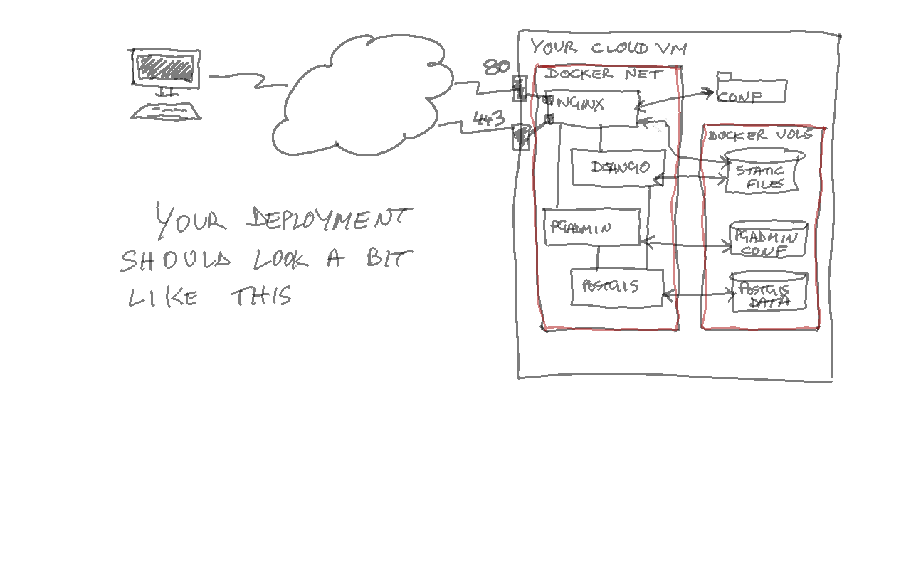

# Assignment 01 Advanced Web Mapping

live at: https://awmcatsite.xyz

it shows your location, draws a 5km radius around it and marks your precise location with an image of a cat that may(probably not) be in the area. cat images courtesy of https://placekitten.com

* Database: PostgreSQL with PostGIS
* Database management: PgAdmin4
* Middle tier(s): Django
* Front-end: Bootstrap 4
* Mapping tech: Leaflet JS with OpenStreetMap
* Deployment architecture sketch by Lecturer:

* Hosting: Digital Ocean

## Config file
The python_config.py file contains the secrets, hosts and debug info. It's in the .gitignore so it isn't uploaded here.

